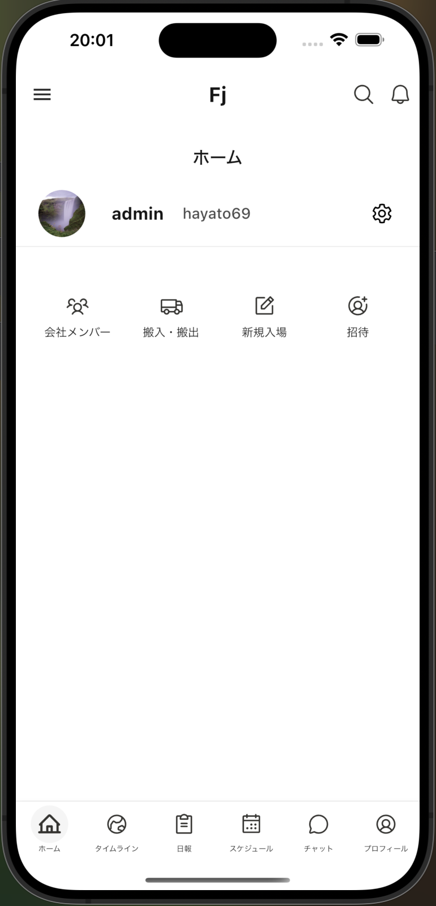
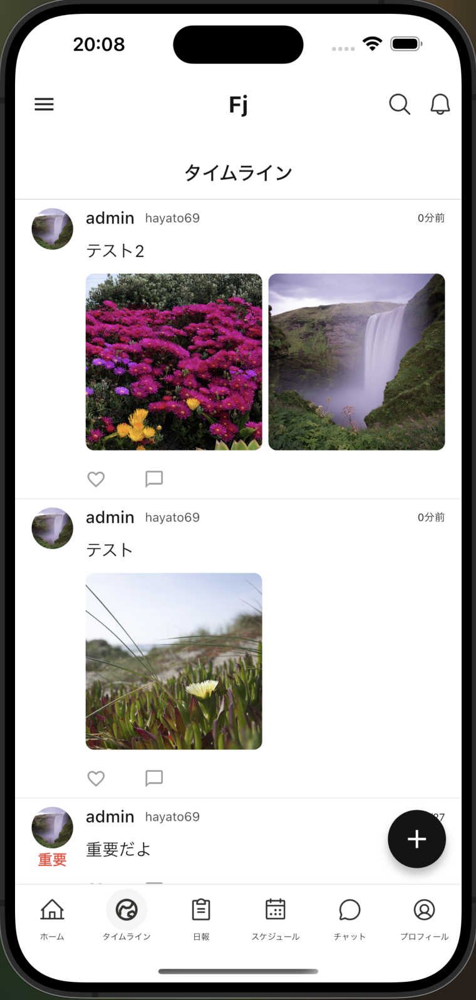
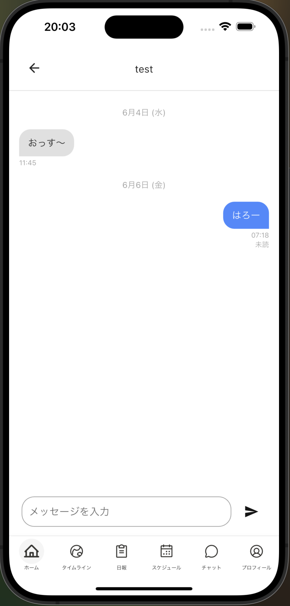
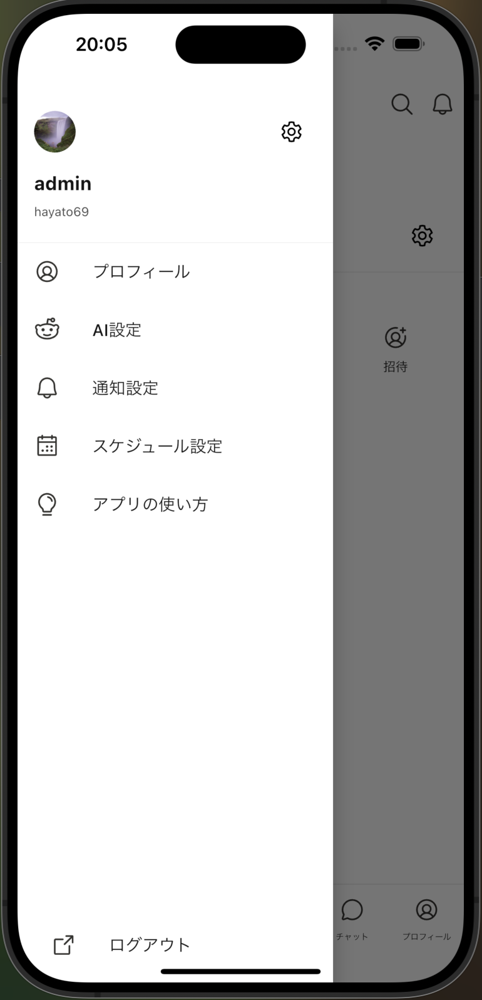

<div align="center">
  
</div>

<h1 align="center">🏗️ 建設業の無駄を減らす 社内SaaS（Flutter × Django）</h1>

<div align="center">
  
</div>

---

## 💡 背景と目的

> **建設現場はあまりにも非効率な業務が多すぎる**
> そんな思いからプログラミングの学習を始めました。
> 自社の建設業で感じた「非効率なやり取り」に不満を感じ、  
> **紙と口頭 を スマホとチャット に置き換える社内ツールを**個人で開発しています。

---

## 🧰 技術スタック

<div align="center">
  
</div>

| カテゴリ       | 使用技術                         |
|----------------|----------------------------------|
| フロントエンド | Flutter, Riverpod, Material UI   |
| バックエンド   | Django REST Framework, Channels |
| 通信           | WebSocket + Redis               |
| DB             | PostgreSQL                      |
| 認証           | JWT（SimpleJWT）                |

---

## 🚀 主な機能

 --- 実装済み機能 ---
- 💬 チャット（DM / グループ、既読管理、招待機能）
- 📝 タイムライン（日報・情報共有）
- 👥 グループ作成・メンバー招待・権限管理
- 👦 プロフィール
- 🏙️ マルチテナント管理 (会社ごとにデータを管理)

 --- 今後実装予定 ---
- 🗓️ スケジュール共有（週単位、タスク表示予定）
- 📃 日報 (提出率を向上させるUX)
- 🚚 搬入・搬出管理 (複数チームでも予定が被らない機能)
- 🗣️ 翻訳機能 (外国人実習生とのやりとりを円滑に)
- 📄 書類アシスト (外国人向、現場の書類を一人で書けるように)
- 📱 会社メンバー管理、権限付与
- 💰 給料・明細自動生成 (日報のデータを参照)

-- リリース後に実装 ---
- 🤖 AIアシスタント（GPT-4連携：予定）

---

## 📸 UI（開発中）

<p align="center">
  
  
  
  
</p>


---

## 💼 転職活動中です

未熟ではありますがこのリポジトリは、技術力・構想力・実行力を見てもらうために公開しています。

- 実務の開発は未経験ですが、個人で企画〜デザイン〜設計〜実装までを継続中です

---

## 📬 Contact

- GitHub: [@kotetsutaisa](https://github.com/kotetsutaisa)
- X: [@fujita_django](https://x.com/fujta_django)


---

## 🧪 ローカル開発・セットアップ

```bash
# フロントエンド
cd frontend
flutter pub get
flutter run

# バックエンド
cd backend
python -m venv venv
source venv/bin/activate
pip install -r requirements.txt
python manage.py runserver
